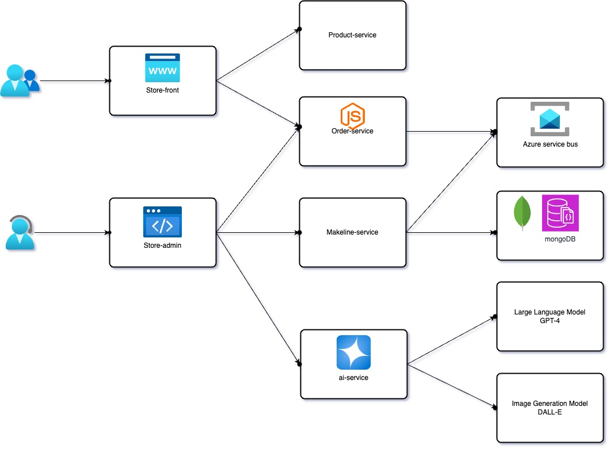

# Full-Stack Cloud-Native Application for Best Buy

## **Overview**

This project is a cloud-native application developed for Best Buy's online store using microservices architecture, Kubernetes, and Azure-managed services. The application follows the design principles of the **Algonquin Pet Store (On Steroids)** with a key modification: the **Order Queue Service** is implemented using **Azure Service Bus** instead of RabbitMQ.

The application includes several services for different user interactions, such as browsing products, managing orders, and generating AI-powered product descriptions and images using GPT-4 and DALL-E.

---

## **Application Architecture**

The application architecture is designed using the following microservices:

- **Store-Front**: Customer-facing app for browsing and placing orders.
- **Store-Admin**: Employee-facing app for managing products and viewing orders.
- **Order-Service**: Handles order creation and sends data to the managed order queue (Azure Service Bus).
- **Product-Service**: Handles CRUD operations for product data.
- **Makeline-Service**: Processes and completes orders by reading from the order queue.
- **AI-Service**: Generates product descriptions and images using GPT-4 and DALL-E models.
- **Database**: MongoDB for persisting order and product data.
- **Virtual-customer**: Simulates order creation on a scheduled basis (Rust).
- **Virtual-worker**: Simulates order completion on a scheduled basis (Rust).

---

## **Architecture Diagram**



---

## **Application and Architecture Explanation**

The **Best Buy App** leverages a microservices architecture to separate the concerns of different services such as product management, order management, and order fulfillment. The key components include:

- **Frontend**: The **Store-Front** is the customer-facing application where users can browse products and place orders.
- **Backend**: The **Order-Service** handles order creation and interacts with the **Order Queue Service** (Azure Service Bus) to ensure smooth order processing. The **Makeline-Service** listens to the queue and completes the orders.
- **Product Data**: The **Product-Service** manages CRUD operations for products stored in MongoDB.
- **AI Integration**: The **AI-Service** generates AI-powered product descriptions and images using **Azure OpenAI Services** (GPT-4 and DALL-E).

---

## **Deployment Instructions**

### **Prerequisites**

- Kubernetes cluster (can be set up using Azure AKS or any other Kubernetes provider).
- Docker for building and pushing images.
- Azure account for using Azure Service Bus and Azure OpenAI Services.

### **Steps to Deploy**

1. **Clone the Repository**

    ```bash
    git clone <your-repo-link>
    cd <your-repo-name>
    ```

2. **Build Docker Images for All Services**
    - For each service, navigate to the service directory and build the Docker image.

    ```bash
    docker build -t <docker-hub-username>/<service-name>:<tag> .
    docker push <docker-hub-username>/<service-name>:<tag>
    ```

3. **Set Up Azure Service Bus**
    - Create an Azure Service Bus and obtain the connection string.
    - Replace the connection string in the Kubernetes secrets.

4. **Configure Kubernetes Manifests**
    - Modify the Kubernetes manifests for each service to use the Docker images and configure the necessary secrets and environment variables.
    - Deploy using `kubectl`:

    ```bash
    kubectl apply -f k8s/
    ```

5. **Verify the Deployment**
    - Check the status of the deployed services:

    ```bash
    kubectl get pods
    kubectl get services
    ```

---

## **Table of Microservice Repositories**

| **Service** | **Repository Link** |
|---------------------|-------------------------------------------|
| Store-Front | [(https://github.com/zhao0294/store-front-bestbuy)] |
| Store-Admin | [store-admin](https://github.com/zhao0294/store-admin-bestbuy) |
| Order-Service | [order-service](https://github.com/zhao0294/order-service-bestbuy) |
| Product-Service | [product-service](https://github.com/zhao0294/product-service-bestbuy) |
| Makeline-Service |[makeline-service](https://github.com/zhao0294/makeline-service-bestbuy) |
| AI-Service | [ai-service](https://github.com/zhao0294/ai-service-service) |
| Mongodb(Database) | [mongodb](https://github.com/docker-library/mongo) |
| Virtual-customer  | [virtual-customer](https://github.com/zhao0294/virtual-customer-bestbuy) |
| Virtual-worker | [virtual-worker](https://github.com/zhao0294/virtual-worker-bestbuy) |

---

## **Table of Docker Images**

| **Service**         | **Docker Image Link**                     |
|---------------------|-------------------------------------------|
| Store-Front         | [congzhao0294/store-front:latest](https://hub.docker.com/r/congzhao0294/store-front)                     |
| Store-Admin         | [congzhao0294/store-admin:latest](https://hub.docker.com/r/congzhao0294/store-admin)                     |
| Order-Service       | [congzhao0294/order-service:latest](https://hub.docker.com/r/congzhao0294/order-service)                      |
| Product-Service     | [congzhao0294/product-service:latest](https://hub.docker.com/r/congzhao0294/product-service)                       |
| Makeline-Service    | [congzhao0294/makeline-service:latest](https://hub.docker.com/r/congzhao0294/makeline-service)                   |
| AI-Service          | [congzhao0294/ai-service:latest](https://hub.docker.com/r/congzhao0294/ai-service)                     |

---

## **Issues and Limitations (Optional)**

- **Scaling**: We are using Kubernetes to manage scalability, but scaling specific services (like AI-Service) based on demand may require fine-tuning.
- **Azure Service Bus**: The integration with Azure Service Bus requires setting up appropriate Azure services and network configurations.
- **AI Response Time**: The AI-generated descriptions and images may take time, depending on the request load and API usage limits.

---

## **License**

This project is licensed under the MIT License - see the [LICENSE](LICENSE) file for details.
